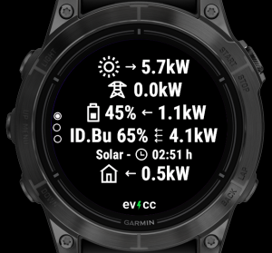

# User Manual evcc-garmin

This is the user manual of evcc-garmin, an app for Garmin wearables, for displaying information from [evcc](https://evcc.io), an open-source software package for solar charging of electric vehicles.

Click [here](https://apps.garmin.com/apps/2bc2ba9d-b117-4cdf-8fa7-078c1ac90ab0) to visit the app's page in the Garmin Connect IQ Store.

Note: before you install this app, read the Connectivity section below to make sure you have all that's needed for the app to access your evcc instance.

If after reading this documentation you still have questions, check the [Support](#support) section for ways of getting additional help.

# Connectivity

Garmin watches rely on your smartphone to access the local network or the Internet. If you're using a VPN solution, such as Tailscale, on your phone to access evcc, it will also work with the watch. However, due to limitations in the Garmin Connect IQ SDK, the evcc HTTP interface can only be accessed via iOS devices. For Android users, an HTTPS endpoint with a valid certificate is required. To set up such an HTTPS endpoint for evcc, you can use a reverse proxy, like NGINX or the one integrated into Synology DiskStations, and obtain a certificate from Let's Encrypt.

# Settings

After installing the app, start with setting up your evcc site.

To access the settings, open evcc in the Connect IQ App:

## Sites

Newer devices support multiple sites, while older ones can display only one. Check the [devices section](#supported-devices) to find out about your device's capabilities.

For the site, configure the following settings:

| Setting             | Description      |
|---------------------|------------------|
| URL                 | URL in format https://host:port. http is supported only when your wearable is connected to an iOS device. See the [Connectivity](#connectivity) section above. |
| Username            | User name for basic authentication, in case you are using a reverse proxy or similar, for example to access evcc from the Internet. |
| Password            | Password for basic authentication. |
| Forecast adjustment | If your site has forecasts configured, this option is the equivalent to the "adjust solar forecast based on real production data" in the evcc UI. If enabled, the forecast widget will show data adjusted by the scale factor provided by evcc. |

## Global Settings

The following settings apply to all configured sites.

| Setting             | Description      |
|---------------------|------------------|
| Refresh interval    | In seconds, from 5-60 The interval in which new data is requested from your evcc site. |
| Data expiry         | In seconds, from 5-3600 When bringing the full-featured glance or widget into view, data not older than the expiry time may be displayed until new data becomes available. |

# User Interface

The user interface is made up of widgets and glances. Widgets are full-screen apps with multiple views. On older devices, you just cycle through widgets directly from your watch face. On newer devices, glances provide a provides quick access to essential information without needing to open a full app.

## Glance

Depending on the memory available for glances on your device, either the Full Glance or the Tiny Glance implementation will be used. Check the [devices section](#supported-devices) about the capabilities of your wearable.

If you have multiple sites configured, the glances will always show data of the site last selected in the widget.

<table>
  <tr><td width="300px" valign="top"><h4>Full Glance</h4>If enough memory is available, the glance will display battery and vehicle SoC as well as charging/discharging indication, updated in the configured <a href="#global-settings">interval</a>.</td><td></td></tr>
</table>
 
<table>
  <tr><td width="300px" valign="top"><h4>Tiny Glance</h4>On devices with less memory, the glance only displays battery and vehicle SoC. On those devices, there is not enough memory for the glance to process the state from evcc. Instead, the state is requested by a background task, and Garmin limits this to every five minutes. Therefore more time-sensitive information about charging/discharging is not shown and the glance indicates the age of the data in minutes.</td><td></td></tr>
</table>

## Widget

The widget consists of a main view showing the most important stats of your site, and additional, detail views (currently only forecast, more may be added in the future).

Within the widget, the following inputs are accepted.

| Input | Action |
|-------|--------|
| **select key** **enter key** **tap** (touchscreen) **swipe left** (touchscreen)| Opens lower-level views, see the sections below for details. The availability of lower-level views is always indicated by an arc next to the key to be pressed to reach them. |
| **up key** **down key** **swipe up** (touchscreen) **swipe down** (touchscreen)| Switch between same-level views in a carousel.|
| **back key** | Returns to the higher-level view. |
| **menu key** | The menu key opens the [system info](#system-info) view, if it is available on your device.|

The structure of the widget views depends on your device and configuration.

## Devices with Glance

The following descriptions apply to devices where the widget is started from a glance.

### One Site (with Glance)

If you have one site configured and open the widget from the glance, you'll start into a carousel with the main view and any available detail views such as forecast.

<table>
  <tr>
    <td></td>
    <td></td>
  </tr>
  <tr>
    <td align="center">Main View</td>
    <td align="center">Forecast View</td>
  </tr>
</table>

### Multiple Sites (with Glance)

If you have multiple site configured and open the widget from the glance, you'll start into a carousel with the sites. At the top of each view, the widget will display the site title (due to limited space the first nine characters only).

For sites with detail views, an arc indicates the **select button** to be pressed to reach those. If the devices support it also a **tap** or **swipe left** on the touch screen will open the specialized views. A press of the **back button** will return to the main view of the site.

<table>
  <tr>
    <td></td>
    <td></td>
    <td></td>
  </tr><tr>
    <td align="center" valign="top" width="33.33%">First site with arc indicating lower-level views.</td>
    <td align="center" valign="top" width="33.33%">Second sites without lower-level views.</td>
    <td align="center" valign="top" width="33.33%">For the first site the arc indicates availability of the forecast view shown here.</td>
  </tr>
</table>

## Devices with Widgets Only

On devices without glances, widgets are directly organized in a carousel and initially the main view of your site is shown.

### One Site (Widget Only)

With one site configured, the main view will be shown as part of the widget carousel, and any available detail views will be shown as lower-level views, indicated by the arc.

<table>
  <tr>
    <td></td>
    <td></td>
  </tr>
  <tr>
    <td align="center">Main View</td>
    <td align="center">Forecast View</td>
  </tr>
</table>

### Multiple Sites (Widget Only)

If you have multiple site configured the main view of the last selected site will be shown as part of the widget carousel. On the lower level, you'll then find a carousel of all main views, from each of which you can reach detail views if available. At the top of each view, the widget will display the site title (due to limited space the first nine characters only).

<table>
  <tr>
    <td></td>
    <td></td>
    <td></td>
    <td></td>
  </tr><tr>
    <td align="center" valign="top" width="25%">The initial view that is part of the Widget carousel.</td>
    <td align="center" valign="top" width="25%">Opening it opens a carousel with main views of all sites. Here the first site ...</td>
    <td align="center" valign="top" width="25%">... and the second site.</td>
    <td align="center" valign="top" width="25%">For the first site the arc indicates availability of the forecast view shown here.</td>
  </tr>
</table>

## System Info

On most devices a system info view is available, only on a very few it has been ommitted due to limited memory. Check the [devices section](#supported-devices) to find out if your device has the system info view.

It can be opened from any widget (not the glance), buy using the **menu key** or the corresponding touch behavior. For example on the Fenix and Epix wearables, the **menu key** is a long press on the middle button on the left side.

# Supported Devices

In the table below you'll find a list of supported devices and their capabilities. Click on the header of each column to find out more about the specific property.

| Watch              | [Fonts](#fonts) | [Max Sites](#max-sites) | [Glance](#glance) | [System Info](#system-info) | Notes                                                                              |
|--------------------|:----------:|:---------:|:------:|:-----------:|------------------------------------------------------------------------------------|
| fenix6             | Static     | 1         | -      | No          | May not work with large sites (memory limit)   No glance due to memory limits   |
| fenix6s            | Static     | 1         | -      | No          | May not work with large sites (memory limit)   No glance due to memory limits   |
| fenix6pro          | Static     | 1         | Tiny   | Yes         |                                                                                    |
| fenix6spro         | Static     | 1         | Tiny   | Yes         |                                                                                    |
| fenix6xpro         | Static     | 1         | Tiny   | Yes         |                                                                                    |
| fenix7             | Vector     | 5         | Full   | Yes         |                                                                                    |
| fenix7s            | Vector     | 5         | Full   | Yes         |                                                                                    |
| fenix7x            | Vector     | 5         | Full   | Yes         |                                                                                    |
| epix2pro42mm       | Vector     | 5         | Full   | Yes         |                                                                                    |
| epix2pro47mm       | Vector     | 5         | Full   | Yes         |                                                                                    |
| epix2pro51mm       | Vector     | 5         | Full   | Yes         |                                                                                    |
| fenix7pro          | Vector     | 5         | Full   | Yes         |                                                                                    |
| fenix7spro         | Vector     | 5         | Full   | Yes         |                                                                                    |
| fenix7xpro         | Vector     | 5         | Full   | Yes         |                                                                                    |
| fenix7xpronowifi   | Vector     | 5         | Full   | Yes         |                                                                                    |
| fenix843mm         | Vector     | 5         | Full   | Yes         |                                                                                    |
| fenix847mm         | Vector     | 5         | Full   | Yes         |                                                                                    |
| fenix8solar47mm    | Vector     | 5         | Full   | Yes         |                                                                                    |
| fenix8solar51mm    | Vector     | 5         | Full   | Yes         |                                                                                    |
| fr745              | Static     | 1         | Tiny   | Yes         |                                                                                    |
| fr945              | Static     | 1         | Tiny   | Yes         |                                                                                    |
| fr945lte           | Static     | 1         | Tiny   | Yes         |                                                                                    |
| fr955              | Vector     | 5         | Full   | Yes         |                                                                                    |
| fr265              | Vector     | 5         | Full   | Yes         |                                                                                    |
| fr265s             | Vector     | 5         | Full   | Yes         |                                                                                    |
| fr965              | Vector     | 5         | Full   | Yes         |                                                                                    |
| venu2              | Static-Opt | 5         | Full   | Yes         |                                                                                    |
| venu2plus          | Static-Opt | 5         | Full   | Yes         |                                                                                    |
| venu2s             | Static-Opt | 5         | Full   | Yes         |                                                                                    |
| venu3              | Vector     | 5         | Full   | Yes         |                                                                                    |
| venu3s             | Vector     | 5         | Full   | Yes         |                                                                                    |
| vivoactive3        | Static     | 1         | -      | No          | May not work with large sites (memory limit)                                       |
| vivoactive3m       | Static     | 1         | -      | No          |                                                                                    |
| vivoactive3mlte    | Static     | 1         | -      | No          | May not work with large sites (cpu limit)                                          |
| vivoactive4        | Static     | 5         | -      | Yes         |                                                                                    |
| vivoactive4s       | Static     | 5         | -      | Yes         |                                                                                    |
| vivoactive5        | Static-Opt | 5         | Full   | Yes         |                                                                                    |

## Max Sites

On devices with less memory available, the number of sites has been limited to one. If you use one of those devices and would like to use multiple devices, please [contact](#support) the developer.

## Fonts

The app has five font sizes available and decides between them based on the amount of content to be displayed. Depending on the device, the five fonts are choosen differently:

| Fonts | Description |
|-------|-------------|
| Vector | If the device supports vector fonts, the five sizes are calculated to achieve even distribution from largest to smallest |
| Static | If no vector fonts are supported, standard font sizes have to be used (medium, small, tiny, glance, xtiny). The jumps between the sizes may be uneven (e.g. jump from largest to second-largest may different than from second-smallest do smallest) |
| Static&#8209;Opt | Opt stands for optimized. On some devices, adjacent font sizes may actually have the same size (e. g. font size small and tiny may actually be the same). The list of fonts will be optimized to sort out those duplicates, effectively giving the app a wider range of font sizes to effectively display content. |

# Troubleshooting

This sections describes common erros that may occur. If you are not able to resolve an error, don't hesitate to get some [support](#support).

## Request Failed
In case you get a "Request failed" error in the app, positive error codes indicate HTTP response codes returned by the server. Negative codes indicate Garmin Connect IQ SDK errors, to get an explanation open [this page](https://developer.garmin.com/connect-iq/api-docs/Toybox/Communications.html) and scroll down to the Constant Summary section.

Below you'll find an explanation of common "Request Failed" error codes:

| Code | Symbol | Description | 
|------------|--------|-------------|
| -1001 | SECURE_CONNECTION_REQUIRED | One regularly encountered error is -1001, which you'll get when you try to use an HTTP URL without encryption with Android, but in some cases also when Garmin does not accept the certificate of your server.|
| -300 | NETWORK_REQUEST_TIMED_OUT | For -300 apart from the obvious reason of the server not being reachable, it could also indicate that the Garmin Connect app on your mobile phone does not have the necessary permissions. For iOS, you can check in Settings for the Connect app if the Local Network permission is enabled.|
| -403 | NETWORK_RESPONSE_OUT_OF_MEMORY | For -300 apart from the obvious reason of the server not being reachable, it could also indicate that the Garmin Connect app on your mobile phone does not have the necessary permissions. For iOS, you can check in Settings for the Connect app if the Local Network permission is enabled.|
| -300 | NETWORK_REQUEST_TIMED_OUT | In case you encounter a -403 error, it indicates that the memory the watch makes available for the app is not sufficient for processing the response from evcc. Please [contact](#support) the developer if you encounter such a message. |
| -202 | INVALID_HTTP_METHOD_IN_REQUEST | A -202 error may indicate that your device does not support the the query string in the request to evcc that reduces the response size. This has been observed on mobile devices with iOS 16, but others may be affected as well. In app version v1.3, this should be resolved, if you encounter it anyway, please [contact](#support) the developer. |

## expected Number/Float/Long/Double

You may get this error because you are using an older version of the app to access an evcc instance with version 0.133.0 or newer. Make sure to have installed the latest version of the app. Instances have occured where an older version was installed by the Connect IQ app, despite a newer one being available. In this case uninstalling the app and then installing it again may help.

# Support

You can get help by writing in [this thread](https://github.com/evcc-io/evcc/discussions/14013) in the evcc forum, or by contacting the developer via the Contact Developer link on the [app's page](https://apps.garmin.com/en-US/apps/2bc2ba9d-b117-4cdf-8fa7-078c1ac90ab0) in the Connect IQ Store.

<!--
-->
