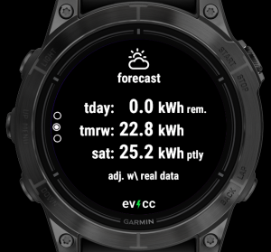
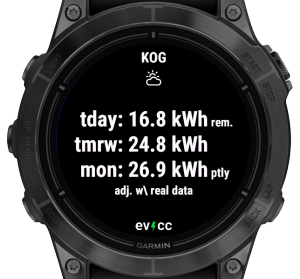

This user manual covers evccg, a Garmin wearable app that displays data from [evcc](https://evcc.io), an open-source software solution for solar-powered EV charging.

Click [here](https://apps.garmin.com/apps/2bc2ba9d-b117-4cdf-8fa7-078c1ac90ab0) to visit the app’s page in the Garmin Connect IQ Store.

> Note: Before installing the app, refer to the [Connectivity](#connectivity) section below to ensure you have everything required for the app to connect to your evcc instance.

If you still have questions after reading this guide, check the [Support](#help--support) section for additional assistance.

# Table of Contents

- [Connectivity](#connectivity)
- [Settings](#settings)
- [User Interface](#user-interface)
  - [Glance](#glance)
  - [Widget](#widget)
  - [Error Handling](#error-handling)
- [Supported Devices](#supported-devices)
- [Troubleshooting](#troubleshooting)
- [Help & Support](#help--support)
- [Changelog](#changelog)
- [GitHub](#github)

# Connectivity

Garmin watches rely on your smartphone to connect to the local network or the Internet. If you use a VPN solution like Tailscale on your phone to access evcc, it will also work with the watch. However, due to limitations in the Garmin Connect IQ SDK, the evcc HTTP interface is only accessible on iOS devices. Android users must use an HTTPS endpoint with a valid certificate. To set up an HTTPS endpoint for evcc, you can for example use a reverse proxy such as NGINX or the built-in option on Synology DiskStations, along with a certificate from Let's Encrypt.

# Settings

After installing the app, begin by configuring your evcc site.

To access the settings, open evcc in the Connect IQ App:

<table class="layoutTable">
  <tr>
    <td width="50%"></td>
    <td width="50%"></td>
  </tr>
</table>

## Sites

Newer devices support multiple sites, whereas older ones can display only one. Refer to the [devices section](#supported-devices) to check your device's capabilities.

Configure the following settings for each site:

| Setting             | Description      |
|---------------------|------------------|
| URL                 | Enter the URL in the format: https://host:port or http://host:port. HTTP is only supported when your wearable is connected to an iOS device. Refer to the [Connectivity](#connectivity) section above for details.|
| Username            | Username for basic authentication, required if using a reverse proxy or similar setup to access evcc from the Internet. |
| Password            | Password for basic authentication. |
| Forecast&nbsp;adjustment | If your site has forecasts enabled, this option corresponds to the "Adjust solar forecast based on real production data" setting in the evcc UI. When activated, the forecast widget will display data adjusted by the scale factor provided by evcc. |

## Global Settings

The following settings are applied to all configured sites:

| Setting             | Description      |
|---------------------|------------------|
| Refresh&nbsp;interval    | The frequency at which new data is requested from your evcc site. The refresh interval can be set between 5 and 60 seconds. If you have multiple sites configured, the currently displayed site will be updated at the configured interval. At the same interval - but offset in time - another site will be updated in a round-robin fashion. |
| Data&nbsp;expiry         | When viewing the [full-featured glance](#glance) or the widget, data within the expiry time may be shown until new data is retrieved. The expiry time can be set between 5 and 3600 seconds. |

# User Interface

The interface consists of widgets and glances. Widgets are full-screen apps with multiple views. On older devices, you cycle through widgets directly from the watch face. On newer devices, glances offer quick access to key information without opening a full app.

## Glance

Depending on your device’s memory capacity for glances, either the full-featured or tiny glance implementation will be used. Refer to the [devices section](#supported-devices) section to check your wearable's capabilities.

If multiple sites are configured, glances will always display data from the last site selected in the widget.

<table class="layoutTable">
  <tr>
    <td width="50%"><h3>Full-Featured Glance</h3></td>
    <td width="50%"><h3>Tiny Glance</h3></td>
  </tr>
  <tr>
    <td></td>
    <td></td>
  </tr>
  <tr>
    <td style="text-align: left" valign="top">If sufficient memory is available, the glance will show battery and vehicle SoC along with charging/discharging status, updating at the configured <a href="#global-settings">interval</a>.</td>
    <td style="text-align: left" valign="top">On devices with limited memory, the glance displays only battery and vehicle SoC. Due to memory constraints, it cannot process the state from evcc directly. Instead, a background task retrieves the state, which Garmin restricts to every five minutes. As a result, real-time charging/discharging information is not shown, and the glance indicates the data's age in minutes.</td>
  </tr>
</table>

## Widget

The widget features a main view displaying key site statistics, along with additional detail views.

This section begins with the following topics:

- [Keys & Gestures](#keys--gestures)
- [Site Views](#site-views)

It then details navigation between site views based on your settings and device:

- [Navigation Flow: one site, launched from glance](#navigation-flow-one-site-launched-from-glance)
- [Navigation Flow: multiple sites, launched from glance](#navigation-flow-multiple-sites-launched-from-glance)
- [Navigation Flow: one site, widget only](#navigation-flow-one-site-widget-only)
- [Navigation Flow: multiple sites, widget only](#navigation-flow-multiple-sites-widget-only)

Finally, it concludes with an overview of the general system information view:

- [System Info View](#system-info-view-view)

### Keys & Gestures

The following inputs are supported within the widget:

| Input | Action |
|-------|--------|
| up/down&nbsp;key touchscreen&nbsp;swipe&nbsp;up/down| Cycle through views at the same level in a carousel format. Page dots represent the total number of views in the carousel and highlight the currently active view. |
| select/enter&nbsp;key touchscreen&nbsp;tap/swipe&nbsp;left| Opens lower-level views—see the sections below for details. When a lower-level view is available, an arc next to the corresponding key indicates it:  This arc is shown on both touch and non-touch devices. On touch devices, you can also use tap input or swipe left. If a touch device has no physical key for this action, a tap indicator is shown instead of the arc:  On **Vivoactive 3** and **Vivoactive 4**, when in the widget carousel, lower-level views can only be opened by tapping—swiping left or using the keys will not work. |
| back&nbsp;key | Navigates back to the previous higher-level view. |
| menu&nbsp;key touchscreen&nbsp;hold | Pressing the menu key opens the [System Info](#system-info-view) view, if supported by your device. On touchscreen devices, you can also tap and hold the screen to access it. This is especially important for devices without a menu key, such as the **Vivoactive 6**. |

### Site Views

The most important view is the main view of the site:

<table class="layoutTable">
  <tr>
    <td width="33.33%"></td>
    <td></td>
    <td></td>
  </tr>
</table>

The main view includes fixed elements representing power flows from the PV, grid, and home. Dynamic elements, such as the battery and load points, are limited to a maximum of six.

If a battery is present, the house battery is always displayed first. When multiple batteries exist, a single element consolidates the total data from all batteries.

Load points appear only when a vehicle is connected. Each load point displays a main line with the vehicle name, power flow, state of charge (SoC), and charging mode. If the vehicle is charging, a smaller secondary line shows the charging mode and estimated remaining charge time. The layout prioritizes displaying as many load points as possible, with secondary lines shown only if space permits.

Beyond the main view, additional detail views are available:

#### Forecast View

The forecast displays the remaining energy for today, tomorrow, and partially for the day after tomorrow. Since data is available for a 48-hour period, the forecast for the day after tomorrow includes values up to the current time.

<table class="layoutTable">
  <tr>
    <td width="33.33%"></td>
    <td></td>
    <td></td>
  </tr>
</table>

The view includes an option equivalent to the "Adjust solar forecast based on real production data" setting in the evcc user interface. When this option is enabled in the [Site Settings](#sites) of the app, the forecast view will display data adjusted using the scale factor provided by evcc. This adjustment is indicated by the label "adj. w/ real data" in the view.

**Note for devices using the tiny glance**: These devices do not have enough memory to support the glance and background processes handling forecast data. As a result, the full state including the forecast will only be requested when the widget is opened. Since the forecast is optional, the forecast view will be added only after the response is received.

#### Statistics View

The statistics view displays the percentage of solar energy relative to the total energy consumed across all load points.

<table class="layoutTable">
  <tr>
    <td width="33.33%"></td>
    <td></td>
    <td></td>
  </tr>
</table>

Data is presented for four time periods: the last 30 days, year to date, the last 365 days, and the entire period since data collection began.

 

### Navigation Flow: one site, launched from glance

If you have a single site configured and launch the widget from the glance, you'll enter a carousel featuring the main view and any available detail views, such as the forecast.

<table class="layoutTable">
  <tr>
    <td width="33.33%"></td>
    <td></td>
    <td></td>
  </tr>
  <tr>
    <td style="padding-bottom: 20px;" align="center">Main View</td>
    <td></td>
    <td></td>
  </tr>
  <tr>
    <td width="33.33%"></td>
    <td></td>
    <td></td>
  </tr>
  <tr>
    <td align="center">Forecast View</td>
    <td></td>
    <td></td>
  </tr>
</table>

### Navigation Flow: multiple sites, launched from glance

If you have multiple sites configured and launch the widget from the glance, you'll enter a carousel displaying the sites. The site title appears at the top of each view, limited to the first nine characters due to space constraints.

For sites with detail views, an arc indicates the select button to press for access. If supported by the device, a tap or swipe left on the touchscreen can also open these specialized views. Pressing the back button will return to the site's main view.

<table class="layoutTable">
  <tr>
    <td width="33.33%"></td>
    <td width="33.33%"></td>
    <td></td>
  </tr><tr>
    <td style="padding-bottom: 20px" align="center" valign="top">First site, with an arc indicating available lower-level views.</td>
    <td style="padding-bottom: 20px" align="center" valign="top">Forecast view for the first site.</td>
    <td></td>
  </tr>
  <tr>
    <td align="center"></td>
  </tr><tr>
    <td align="center" valign="top">Second site without lower-level views.</td>
    <td></td>
  </tr>
</table>

### Navigation Flow: one site, widget only

On devices that do not support glances, widgets are arranged in a carousel, with a single initial view representing each widget.

If a single site is configured, the main view of your site will appear in the widget carousel, with any available detail views accessible as lower-level views, indicated by an arc.

<table class="layoutTable">
  <tr>
    <td width="33.33%"></td>
    <td width="33.33%"></td>
    <td></td>
  </tr>
  <tr>
    <td align="center">Main View</td>
    <td align="center">Forecast View</td>
    <td></td>
  </tr>
</table>

### Navigation Flow: multiple sites, widget only

If multiple sites are configured, the main view of the last selected site will appear in the widget carousel. On the lower level, a carousel of all main views is available, allowing access to detail views where applicable. The site title is displayed at the top of each view, limited to the first nine characters due to space constraints.

<table class="layoutTable">
  <tr>
    <td width="33.33%"></td>
    <td width="33.33%"></td>
    <td width="33.33%"></td>
  </tr>
  <tr>
    <td style="padding-bottom: 20px" align="center" valign="top">The initial view included in the widget carousel.</td>
    <td style="padding-bottom: 20px" align="center" valign="top">Opening it launches a carousel featuring the main views of all sites. Here, the first site...</td>
    <td style="padding-bottom: 20px" align="center" valign="top">For the first site, the arc indicates that the forecast view is available, as shown here.</td>
  </tr>
  <tr>
    <td></td>
    <td></td>
  </tr>
  <tr>
    <td></td>
    <td align="center" valign="top">... and the second site in the carousel.</td>
  </tr>
</table>

### System Info View

On most devices, a system info view is available, though a few lack this feature due to limited memory. Check the [devices section](#supported-devices) to see if your device includes the system info view.  

You can open it from any widget (but not from the glance) by using the menu key or the corresponding touch gesture. For example, on Fenix and Epix wearables, the menu key is accessed by long-pressing the middle button on the left side. On touch-oriented devices, tap and hold the touch screen.

The view shows the evcc-garmin version, the Connect IQ (monkey) version supported by the device, and the device's part number.

<table class="layoutTable">
  <tr>
    <td width="33.33%"></td>
    <td></td>
    <td></td>
  </tr>
</table>

## Error Handling

Errors are displayed only in the views directly affected, ensuring the rest of the app continues to function normally. Examples include:

- No configured sites: A general error message is shown.

- Multiple Views per Site: If a site encounters an error, all views associated with that site will display the error.

- Multiple Configured Sites: If an error (e.g., a connection failure) affects only one site, only that site’s views will show the error. Views for other sites will remain functional.

- Temporary Errors: If the current state cannot be fetched (e.g., due to a connectivity issue), the glance and widget views will display a previously stored state—provided it is still valid. Detail views will also be generated from the stored state if available. An error message will only be shown if the issue persists after the cached data expires.

- Glance view: When multiple sites are configured, the glance view displays only general errors or errors related to the currently displayed site.

 

# Supported Devices

The table below lists supported devices along with their capabilities. Click on a column header to learn more about a specific property.

| Watch              | [Glance](#glance) | [Max Sites](#max-sites) | [Detail Views](#detail-views) | [Fonts](#fonts)  | Notes                                                                              |
|--------------------|:-----------------:|:-----------------------:|:--------------------------------:|:----------------:|------------------------------------------------------------------------------------|
| fenix6             | Tiny              | 1                       | No                               | Static           | May not work with large sites (memory limit)   No glance due to memory limits   |
| fenix6s            | Tiny              | 1                       | No                               | Static           | May not work with large sites (memory limit)   No glance due to memory limits   |
| fenix6pro          | Tiny              | 1                       | Yes                              | Static           |                                                                                    |
| fenix6spro         | Tiny              | 1                       | Yes                              | Static           |                                                                                    |
| fenix6xpro         | Tiny              | 1                       | Yes                              | Static           |                                                                                    |
| fenix7             | Full              | 5                       | Yes                              | Vector           |                                                                                    |
| fenix7s            | Full              | 5                       | Yes                              | Vector           |                                                                                    |
| fenix7x            | Full              | 5                       | Yes                              | Vector           |                                                                                    |
| epix2pro42mm       | Full              | 5                       | Yes                              | Vector           |                                                                                    |
| epix2pro47mm       | Full              | 5                       | Yes                              | Vector           |                                                                                    |
| epix2pro51mm       | Full              | 5                       | Yes                              | Vector           |                                                                                    |
| fenix7pro          | Full              | 5                       | Yes                              | Vector           |                                                                                    |
| fenix7pronowifi    | Full              | 5                       | Yes                              | Vector           |                                                                                    |
| fenix7spro         | Full              | 5                       | Yes                              | Vector           |                                                                                    |
| fenix7xpro         | Full              | 5                       | Yes                              | Vector           |                                                                                    |
| fenix7xpronowifi   | Full              | 5                       | Yes                              | Vector           |                                                                                    |
| fenix843mm         | Full              | 5                       | Yes                              | Vector           |                                                                                    |
| fenix847mm         | Full              | 5                       | Yes                              | Vector           |                                                                                    |
| fenix8solar47mm    | Full              | 5                       | Yes                              | Vector           |                                                                                    |
| fenix8solar51mm    | Full              | 5                       | Yes                              | Vector           |                                                                                    |
| fr745              | Tiny              | 1                       | Yes                              | Static           |                                                                                    |
| fr945              | Tiny              | 1                       | Yes                              | Static           |                                                                                    |
| fr945lte           | Tiny              | 1                       | Yes                              | Static           |                                                                                    |
| fr955              | Full              | 5                       | Yes                              | Vector           |                                                                                    |
| fr165              | Full              | 5                       | Yes                              | Vector           |                                                                                    |
| fr165m             | Full              | 5                       | Yes                              | Vector           |                                                                                    |
| fr265              | Full              | 5                       | Yes                              | Vector           |                                                                                    |
| fr265s             | Full              | 5                       | Yes                              | Vector           |                                                                                    |
| fr965              | Full              | 5                       | Yes                              | Vector           |                                                                                    |
| venu2              | Full              | 5                       | Yes                              | Static&#8209;Opt |                                                                                    |
| venu2plus          | Full              | 5                       | Yes                              | Static&#8209;Opt |                                                                                    |
| venu2s             | Full              | 5                       | Yes                              | Static&#8209;Opt |                                                                                    |
| venu3              | Full              | 5                       | Yes                              | Vector           |                                                                                    |
| venu3s             | Full              | 5                       | Yes                              | Vector           |                                                                                    |
| vivoactive3        | -                 | 1                       | No                               | Static           | May not work with large sites (memory limit)                                       |
| vivoactive3m       | -                 | 5                       | Yes                              | Static           |                                                                                    |
| vivoactive3mlte    | -                 | 5                       | Yes                              | Static           | May not work with large sites (cpu limit)                                          |
| vivoactive4        | -                 | 5                       | Yes                              | Static           |                                                                                    |
| vivoactive4s       | -                 | 5                       | Yes                              | Static           |                                                                                    |
| vivoactive5        | Full              | 5                       | Yes                              | Static&#8209;Opt |                                                                                    |
| vivoactive6        | Full              | 5                       | Yes                              | Vector           |                                                                                    |

## Max Sites

On devices with limited memory, the number of supported sites is restricted to one. If you’re using one of these devices and need support for multiple sites, please [contact](#help--support) the developer.

## Fonts

The app offers five font sizes and selects the most suitable one based on the content being displayed. The way these font sizes are determined depends on the device:

| Fonts       | Description |
|------------|-------------|
| Vector | If the device supports vector fonts, the five sizes are evenly distributed from largest to smallest for a balanced appearance. |
| Static | On devices without vector font support, predefined font sizes must be used (medium, small, tiny, glance, xtiny). This can result in uneven size differences, such as a larger gap between the largest and second-largest font than between the smallest ones. |
| Static&#8209;Opt | "Opt" stands for optimized. On some devices, certain adjacent font sizes may be identical (e.g., small and tiny could appear the same). In such cases, duplicate sizes are removed, effectively increasing the range of distinct font sizes available for better content display. |

## Detail Views

On some devices with very limited memory available to apps, the [detail views](#site-views) of the site and the [system info view](#system-info-view) are not available.

# Troubleshooting

This section outlines common errors that may occur. If you're unable to resolve an issue, feel free to seek [support](#help--support).  

## Request Failed  
If you encounter a "Request Failed" error in the app, the error code can help determine the cause:  
- Positive error codes correspond to HTTP response codes returned by the server.  
- Negative error codes indicate Garmin Connect IQ SDK errors. For a comprehensive documentation of these codes, visit [this page](https://developer.garmin.com/connect-iq/api-docs/Toybox/Communications.html) and scroll to the **Constant Summary** section.  

Here is a breakdown of common "Request Failed" error codes:

| Code      | Symbol                           | Description |
|-----------|----------------------------------|-------------|
| -1001 | SECURE_CONNECTION_REQUIRED       | This error occurs when attempting to use an unencrypted HTTP URL on Android. It may also appear if Garmin does not accept the certificate of your server. |
| -300  | NETWORK_REQUEST_TIMED_OUT        | While this may indicate the server is unreachable, it can also mean the Garmin Connect app lacks necessary permissions. On iOS, check if the Local Network permission is enabled in the device settings for the Connect app. |
| -403  | NETWORK_RESPONSE_OUT_OF_MEMORY   | This error suggests that the watch does not have enough memory to process the response from evcc. If you encounter this issue, please [contact](#help--support) the developer. |
| -202  | INVALID_HTTP_METHOD_IN_REQUEST   | This error may indicate that your device does not support the query string used in evcc requests to minimize response size. It has been observed on some iOS 16 devices. The issue should be resolved in app version v1.3, but if it persists, please [contact](#help--support) the developer. |

## Other Errors

Some other common errors are:

| Error | Description |
|-------|-------------|
| expected Number/Float/Long/Double | This error may occur if you're using an older version of the app to access an evcc instance running version 0.133.0 or later. Ensure you have the latest version of the app installed. In some cases, the Connect IQ app may install an outdated version despite a newer one being available. If this happens, try uninstalling and reinstalling the app.

# Help & Support

You can get help by posting in [this thread](https://github.com/evcc-io/evcc/discussions/14013) on the evcc forum or by reaching out to the developer via the **Contact Developer** link on the app's [Connect IQ Store page](https://apps.garmin.com/en-US/apps/2bc2ba9d-b117-4cdf-8fa7-078c1ac90ab0).

# Changelog

| Version | Changes |
|--------:|-------------|
| **v1.4** | Added a new statistics view displaying the percentage of solar energy used. Improved performance by pre-rendering views in the background, resulting in faster view transitions. Added support for the newly released Forerunner 165 / 165 Music and Vivoactive 6. Updated feature compatibility for Fenix 6 and the Vivoactive 3 / 3 Music / 3 Music LTE. See [Supported Devices](#supported-devices) for full details. Removed forecast and statistics querying from tiny glance. As a result, on devices using tiny glance, the widget may take a second or two after launch to fetch the full state and display the forecast view. Upgraded to Garmin Connect IQ SDK 8.1.1.
| **v1.3.3** | Fixed an unexpected TypeError that occurred after updating to v1.3.3 on certain devices. Affected models include: Fenix 6 / 6 Pro, Forerunner 745 / 945, and Vivoactive 3 ([Issue #6](https://github.com/TheNinth7/evcc-garmin/issues/2)).
| **v1.3.2** | Fixed issue on Vivoactive 4 where the wrong site opened in multi-site setups ([Issue #4](https://github.com/TheNinth7/evcc-garmin/issues/4)). Added tap hint for Vivoactive 3 / 4 ([Issue #2](https://github.com/TheNinth7/evcc-garmin/issues/2)) Improved content centering between the page indicator and button or tap hints Enhanced vertical spacing for better screen balance with excess whitespace([Issue #3](https://github.com/TheNinth7/evcc-garmin/issues/3))
| **v1.3.1** | Fixed an issue where swiping left triggered a page down on some devices Fixed incorrect display of the page indicator when showing the forecast for the first time Added a jq filter to remove all empty fields, reducing memory usage Added a property for vector font face selection, allowing per-device customization Refactored resource management for improved maintainability
| **v1.3** | Added forecast view Introduced support for additional views, enabling future extensions Optimized memory usage Enhanced UI engine, including improved font selection **ATTENTION:** This update requires you to re-enter your settings. Please ensure you have them noted down beforehand.
| **v1.2.2** | added system info view (opened by menu key)
| **v1.2.1** | improved error handling
| **v1.2** | added support for new REST API structure (grid data) of upcoming evcc versions. Upgraded to Garmin Connect IQ SDK 7.4.3
| **v1.1.1** | Refinement of UI engine
| **v1.1** | Added support for heater loadpoints in widget mode, with display of temperature and power consumption
| **v1.0** | First stable version

# GitHub

You can find the GitHub repository here: [TheNinth7/evcc-garmin](https://github.com/TheNinth7/evcc-garmin).  

The project’s `README.md` provides an overview of the structure and includes additional information to help you better understand the codebase.