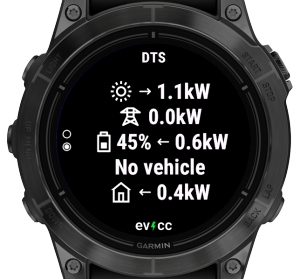
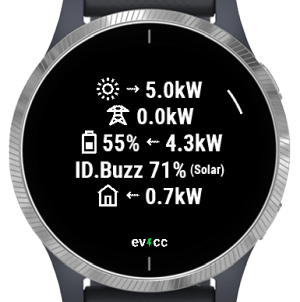
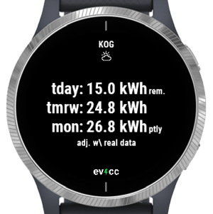
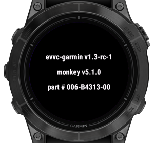

This user manual covers evcc-garmin, a Garmin wearable app that displays data from [evcc](https://evcc.io), an open-source software solution for solar-powered EV charging.

Click [here](https://apps.garmin.com/apps/2bc2ba9d-b117-4cdf-8fa7-078c1ac90ab0) to visit the app’s page in the Garmin Connect IQ Store.

> Note: Before installing the app, refer to the [Connectivity](#connectivity) section below to ensure you have everything required for the app to connect to your evcc instance.

If you still have questions after reading this guide, check the [Support](#support) section for additional assistance.

# Table of Contents

- [Connectivity](#connectivity)
- [Settings](#settings)
- [User Interface](#user-interface)
- [Supported Devices](#supported-devices)
- [Troubleshooting](#troubleshooting)
- [Help & Support](#help--support)

# Connectivity

Garmin watches rely on your smartphone to connect to the local network or the Internet. If you use a VPN solution like Tailscale on your phone to access evcc, it will also work with the watch. However, due to limitations in the Garmin Connect IQ SDK, the evcc HTTP interface is only accessible on iOS devices. Android users must use an HTTPS endpoint with a valid certificate. To set up an HTTPS endpoint for evcc, you can for example use a reverse proxy such as NGINX or the built-in option on Synology DiskStations, along with a certificate from Let's Encrypt.

# Settings

After installing the app, begin by configuring your evcc site.

To access the settings, open evcc in the Connect IQ App:

## Sites

Newer devices support multiple sites, whereas older ones can display only one. Refer to the [devices section](#supported-devices) to check your device's capabilities.

Configure the following settings for the site:

| Setting             | Description      |
|---------------------|------------------|
| URL                 | Enter the URL in the format: https://host:port. HTTP is only supported when your wearable is connected to an iOS device. Refer to the [Connectivity](#connectivity) section above for details.|
| Username            | Username for basic authentication, required if using a reverse proxy or similar setup to access evcc from the Internet. |
| Password            | Password for basic authentication. |
| Forecast&nbsp;adjustment | If your site has forecasts enabled, this option corresponds to the "Adjust solar forecast based on real production data" setting in the evcc UI. When activated, the forecast widget will display data adjusted by the scale factor provided by evcc. |

## Global Settings

The following settings are applied to all configured sites:

| Setting             | Description      |
|---------------------|------------------|
| Refresh&nbsp;interval    | In seconds (5-60) The frequency at which new data is requested from your evcc site.|
| Data&nbsp;expiry         | In seconds (5-3600) When viewing the [full-featured glance](#glance) or the widget, data within the expiry time may be shown until new data is retrieved. |

# User Interface

The interface consists of widgets and glances. Widgets are full-screen apps with multiple views. On older devices, you cycle through widgets directly from the watch face. On newer devices, glances offer quick access to key information without opening a full app.

## Glance

Depending on your device’s memory capacity for glances, either the full-featured or tiny glance implementation will be used. Refer to the [devices section](#supported-devices) section to check your wearable's capabilities.

If multiple sites are configured, glances will always display data from the last site selected in the widget.

<table class="layoutTable">
  <tr>
    <td width="50%"><h3>Full-Featured Glance</h3></td>
    <td width="50%"><h3>Tiny Glance</h3></td>
  </tr>
  <tr>
    <td style="padding-bottom: 20px; text-align: left" valign="top">If sufficient memory is available, the glance will show battery and vehicle SoC along with charging/discharging status, updating at the configured <a href="#global-settings">interval</a>.</td>
    <td style="padding-bottom: 20px; text-align: left" valign="top">On devices with limited memory, the glance displays only battery and vehicle SoC. Due to memory constraints, it cannot process the state from evcc directly. Instead, a background task retrieves the state, which Garmin restricts to every five minutes. As a result, real-time charging/discharging information is not shown, and the glance indicates the data's age in minutes.</td>
  </tr>
  <tr>
    <td></td>
    <td></td>
  </tr>
</table>

<!--
### Full-Featured Glance

If sufficient memory is available, the glance will show battery and vehicle SoC along with charging/discharging status, updating at the configured <a href="#global-settings">interval</a>.

### Tiny Glance

On devices with limited memory, the glance displays only battery and vehicle SoC. Due to memory constraints, it cannot process the state from evcc directly. Instead, a background task retrieves the state, which Garmin restricts to every five minutes. As a result, real-time charging/discharging information is not shown, and the glance indicates the data's age in minutes.

-->

## Widget

The widget features a main view displaying key site statistics, along with additional detail views (currently limited to forecasts, with potential for more in the future).

The following inputs are supported within the widget:

| Input | Action |
|-------|--------|
| **select&nbsp;key** **enter&nbsp;key** **tap** **swipe&nbsp;left**| Opens detailed views—see the sections below for more information. An arc next to the corresponding key indicates when a lower-level view is available. |
| **up&nbsp;key** **down&nbsp;key** **swipe&nbsp;up** **swipe&nbsp;down**| Cycle through views at the same level in a carousel format. |
| **back&nbsp;key** | Navigates back to the previous higher-level view. |
| **menu&nbsp;key** | Pressing the menu key opens the [system info](#system-info) view, if supported by your device. |

The layout of the widget views varies based on your device and settings:

### Devices with Glance

The following descriptions pertain to devices where the widget launches from a glance.

#### One Site (with Glance)

If you have a single site configured and launch the widget from the glance, you'll enter a carousel featuring the main view and any available detail views, such as the forecast.

<table class="layoutTable">
  <tr>
    <td width="50%"></td>
    <td width="50%"></td>
  </tr>
  <tr>
    <td align="center" width="50%">Main View</td>
    <td align="center" width="50%">Forecast View</td>
  </tr>
</table>

#### Multiple Sites (with Glance)

If you have multiple sites configured and launch the widget from the glance, you'll enter a carousel displaying the sites. The site title appears at the top of each view, limited to the first nine characters due to space constraints.

For sites with detail views, an arc indicates the select button to press for access. If supported by the device, a tap or swipe left on the touchscreen can also open these specialized views. Pressing the back button will return to the site's main view.

<table class="layoutTable">
  <tr>
    <td width="50%"></td>
    <td width="50%"></td>
  </tr><tr>
    <td style="padding-bottom: 20px" align="center" valign="top" width="50%">First site, with an arc indicating available lower-level views.</td>
    <td style="padding-bottom: 20px" align="center" valign="top" width="50%">Second site without lower-level views.</td>
  </tr>
  <tr>
    <td colspan="2" align="center"></td>
  </tr><tr>
    <td colspan="2" align="center" valign="top">Forecast view for the first site.</td>
  </tr>
</table>

### Devices with Widgets Only

On devices that do not support glances, widgets are arranged in a carousel, with a single initial view representing each widget.

#### One Site (Widget Only)

If a single site is configured, the main view of your site will appear in the widget carousel, with any available detail views accessible as lower-level views, indicated by an arc.

<table class="layoutTable">
  <tr>
    <td width="50%"></td>
    <td width="50%"></td>
  </tr>
  <tr>
    <td align="center" width="50%">Main View</td>
    <td align="center" width="50%">Forecast View</td>
  </tr>
</table>

#### Multiple Sites (Widget Only)

If multiple sites are configured, the main view of the last selected site will appear in the widget carousel. On the lower level, a carousel of all main views is available, allowing access to detail views where applicable. The site title is displayed at the top of each view, limited to the first nine characters due to space constraints.

<table class="layoutTable">
  <tr>
    <td width="50%"></td>
    <td width="50%"></td>
  </tr><tr>
    <td style="padding-bottom: 20px" align="center" valign="top" width="50%">The initial view included in the widget carousel.</td>
    <td style="padding-bottom: 20px" align="center" valign="top" width="50%">Opening it launches a carousel featuring the main views of all sites. Here, the first site...</td>
  </tr>
  <tr>
    <td></td>
    <td></td>
  </tr><tr>
    <td align="center" valign="top" width="50%">... and the second site in the carousel.</td>
    <td align="center" valign="top" width="50%">For the first site, the arc indicates that the forecast view is available, as shown here.</td>
  </tr>
</table>

## System Info

On most devices, a system info view is available, though a few lack this feature due to limited memory. Check the [devices section](#supported-devices) to see if your device includes the system info view.  

You can open it from any widget (but not from the glance) by using the **menu key** or the corresponding touch gesture. For example, on Fenix and Epix wearables, the **menu key** is accessed by long-pressing the middle button on the left side.

# Supported Devices

The table below lists supported devices along with their capabilities. Click on a column header to learn more about a specific property.

| Watch                  | [Fonts](#fonts) | [Max Sites](#max-sites) | [Glance](#glance) | [System Info](#system-info) | Notes                                                                              |
|------------------------|:----------:|:---------:|:------:|:-----------:|------------------------------------------------------------------------------------|
| fenix6             | Static     | 1         | -      | No          | May not work with large sites (memory limit)   No glance due to memory limits   |
| fenix6s            | Static     | 1         | -      | No          | May not work with large sites (memory limit)   No glance due to memory limits   |
| fenix6pro          | Static     | 1         | Tiny   | Yes         |                                                                                    |
| fenix6spro         | Static     | 1         | Tiny   | Yes         |                                                                                    |
| fenix6xpro         | Static     | 1         | Tiny   | Yes         |                                                                                    |
| fenix7             | Vector     | 5         | Full   | Yes         |                                                                                    |
| fenix7s            | Vector     | 5         | Full   | Yes         |                                                                                    |
| fenix7x            | Vector     | 5         | Full   | Yes         |                                                                                    |
| epix2pro42mm       | Vector     | 5         | Full   | Yes         |                                                                                    |
| epix2pro47mm       | Vector     | 5         | Full   | Yes         |                                                                                    |
| epix2pro51mm       | Vector     | 5         | Full   | Yes         |                                                                                    |
| fenix7pro          | Vector     | 5         | Full   | Yes         |                                                                                    |
| fenix7spro         | Vector     | 5         | Full   | Yes         |                                                                                    |
| fenix7xpro         | Vector     | 5         | Full   | Yes         |                                                                                    |
| fenix7xpronowifi   | Vector     | 5         | Full   | Yes         |                                                                                    |
| fenix843mm         | Vector     | 5         | Full   | Yes         |                                                                                    |
| fenix847mm         | Vector     | 5         | Full   | Yes         |                                                                                    |
| fenix8solar47mm    | Vector     | 5         | Full   | Yes         |                                                                                    |
| fenix8solar51mm    | Vector     | 5         | Full   | Yes         |                                                                                    |
| fr745              | Static     | 1         | Tiny   | Yes         |                                                                                    |
| fr945              | Static     | 1         | Tiny   | Yes         |                                                                                    |
| fr945lte           | Static     | 1         | Tiny   | Yes         |                                                                                    |
| fr955              | Vector     | 5         | Full   | Yes         |                                                                                    |
| fr265              | Vector     | 5         | Full   | Yes         |                                                                                    |
| fr265s             | Vector     | 5         | Full   | Yes         |                                                                                    |
| fr965              | Vector     | 5         | Full   | Yes         |                                                                                    |
| venu2              | Static-Opt | 5         | Full   | Yes         |                                                                                    |
| venu2plus          | Static-Opt | 5         | Full   | Yes         |                                                                                    |
| venu2s             | Static-Opt | 5         | Full   | Yes         |                                                                                    |
| venu3              | Vector     | 5         | Full   | Yes         |                                                                                    |
| venu3s             | Vector     | 5         | Full   | Yes         |                                                                                    |
| vivoactive3        | Static     | 1         | -      | No          | May not work with large sites (memory limit)                                       |
| vivoactive3m       | Static     | 1         | -      | No          |                                                                                    |
| vivoactive3mlte    | Static     | 1         | -      | No          | May not work with large sites (cpu limit)                                          |
| vivoactive4        | Static     | 5         | -      | Yes         |                                                                                    |
| vivoactive4s       | Static     | 5         | -      | Yes         |                                                                                    |
| vivoactive5        | Static-Opt | 5         | Full   | Yes         |                                                                                    |

## Max Sites

On devices with limited memory, the number of supported sites is restricted to one. If you’re using one of these devices and need support for multiple sites, please [contact](#support) the developer.

## Fonts

The app offers five font sizes and selects the most suitable one based on the content being displayed. The way these font sizes are determined depends on the device:

| Fonts       | Description |
|------------|-------------|
| Vector | If the device supports vector fonts, the five sizes are evenly distributed from largest to smallest for a balanced appearance. |
| Static | On devices without vector font support, predefined font sizes must be used (medium, small, tiny, glance, xtiny). This can result in uneven size differences, such as a larger gap between the largest and second-largest font than between the smallest ones. |
| Static&#8209;Opt | "Opt" stands for optimized. On some devices, certain adjacent font sizes may be identical (e.g., small and tiny could appear the same). In such cases, duplicate sizes are removed, effectively increasing the range of distinct font sizes available for better content display. |

# Troubleshooting

This section outlines common errors that may occur. If you're unable to resolve an issue, feel free to seek [support](#support).  

## Request Failed  
If you encounter a "Request Failed" error in the app, the error code can help determine the cause:  
- Positive error codes correspond to HTTP response codes returned by the server.  
- Negative error codes indicate Garmin Connect IQ SDK errors. For a comprehensive documentation of these codes, visit [this page](https://developer.garmin.com/connect-iq/api-docs/Toybox/Communications.html) and scroll to the **Constant Summary** section.  

Here is a breakdown of common "Request Failed" error codes:

| Code      | Symbol                           | Description |
|-----------|----------------------------------|-------------|
| -1001 | SECURE_CONNECTION_REQUIRED       | This error occurs when attempting to use an unencrypted HTTP URL on Android. It may also appear if Garmin does not accept the certificate of your server. |
| -300  | NETWORK_REQUEST_TIMED_OUT        | While this may indicate the server is unreachable, it can also mean the Garmin Connect app lacks necessary permissions. On iOS, check if the Local Network permission is enabled in the device settings for the Connect app. |
| -403  | NETWORK_RESPONSE_OUT_OF_MEMORY   | This error suggests that the watch does not have enough memory to process the response from evcc. If you encounter this issue, please [contact](#support) the developer. |
| -202  | INVALID_HTTP_METHOD_IN_REQUEST   | This error may indicate that your device does not support the query string used in evcc requests to minimize response size. It has been observed on some iOS 16 devices. The issue should be resolved in app version v1.3, but if it persists, please [contact](#support) the developer. |

## Other Errors

Some other common errors are:

| Error | Description |
|-------|-------------|
| expected Number/Float/Long/Double | This error may occur if you're using an older version of the app to access an evcc instance running version 0.133.0 or later. Ensure you have the latest version of the app installed. In some cases, the Connect IQ app may install an outdated version despite a newer one being available. If this happens, try uninstalling and reinstalling the app.

# Help & Support

You can get help by posting in [this thread](https://github.com/evcc-io/evcc/discussions/14013) on the evcc forum or by reaching out to the developer via the **Contact Developer** link on the app's [Connect IQ Store page](https://apps.garmin.com/en-US/apps/2bc2ba9d-b117-4cdf-8fa7-078c1ac90ab0).
